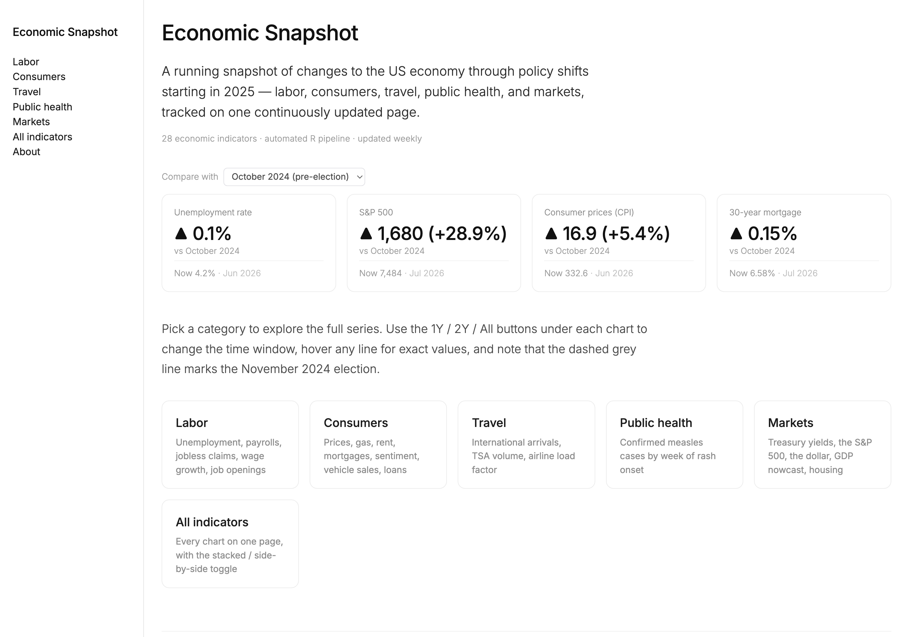

# Economic Snapshot

A self-updating dashboard of core U.S. economic indicators — labor, consumers,
travel, public health, and markets — built on an automated R data pipeline
that pulls from nine live sources through APIs and web scrapers.



## How it works

```
FRED ─┐
BLS  ─┤  API pulls      ┐
TSA  ─┤  + web scrapers ├─▶  data/ (CSV)  ─▶  R/global.R  ─▶  two front ends
CDC  ─┤  (R/run_all.R)  ┘    (gitignored)     (shared prep)    ├─ Quarto website  ← published site
ITA  ─┘                                                        └─ shiny-app/      ← local dashboard
```

- **The Quarto site** (`index.qmd` plus a page per category) is the published
  product: a static multi-page site with interactive plotly charts (hover
  tooltips, 1Y/2Y/All time-window buttons). It renders to plain HTML — no
  server required.
- **`shiny-app/`** is the original Shiny dashboard the Quarto site was ported
  from, kept as a local interactive view. Both front ends share all data
  loading and preparation through `R/global.R`, so their numbers can never
  drift apart.
- **`R/run_all.R`** orchestrates the automated pulls with per-source logging
  and an email alert on failure. Runs on a weekly schedule.

## Data sources

| Source | Series | Method | Frequency |
|---|---|---|---|
| [FRED](https://fred.stlouisfed.org/) (St. Louis Fed) | Unemployment, claims, JOLTS, CPI, sentiment, loans, durable goods, vehicle sales, 10-yr yield, S&P 500, housing starts | API (`fredr`) | Daily–monthly |
| [BLS](https://www.bls.gov/) | Civilian labor force by state | API (`blsAPI`) | Monthly |
| [TSA](https://www.tsa.gov/travel/passenger-volumes) | Checkpoint passenger volumes | Web scrape | Daily |
| [CDC](https://www.cdc.gov/measles/data-research/) | Measles cases by rash-onset week | JSON endpoint | Weekly |
| [ITA I-94](https://www.trade.gov/i-94-arrivals-program) | Visitor arrivals by country of origin | Excel download | Monthly |
| Revelio Labs (via [WRDS](https://wrds-www.wharton.upenn.edu/)) | New online job postings | SQL (licensed; excluded from the public page) | Weekly |

## Quick start

A fresh clone renders immediately from the bundled **synthetic sample data**
(no keys needed):

```sh
git clone <this-repo>
cd <this-repo>
Rscript -e 'renv::restore()'   # install pinned package versions
quarto render                  # renders the whole site from sample_data/
```

To use **real data**:

1. Get free API keys from
   [FRED](https://fred.stlouisfed.org/docs/api/api_key.html) and
   [BLS](https://www.bls.gov/developers/home.htm).
2. Create a `creds/` folder in the repo root and copy `creds_template.env`
   into it as `fred_creds.env` / `bls_creds.env`, filling in your keys
   (`creds/` is gitignored — keys never reach git).
3. `Rscript R/run_all.R` to pull everything into `data/`, then re-render.
   Once `data/` has files, the front ends use it automatically instead of
   the sample.

To run the Shiny version locally: `Rscript -e 'shiny::runApp("shiny-app")'`.

## Repository layout

```
index.qmd               Quarto site landing page
*.qmd / _charts-*.qmd   category pages + shared chart partials
_quarto.yml             site config (sidebar nav, theme)
custom.scss             site theme
R/                      config, shared data prep (global.R), pull scripts
shiny-app/              original Shiny front end (ui.R, server.R)
sample_data/            synthetic sample so a clone renders with no setup
data/                   real pulled data (gitignored; created by run_all.R)
creds/                  API keys (gitignored; template in repo root)
assets/                 README screenshot
setup_cron.sh           installs the weekly local pull schedule (macOS cron)
```

## Data licensing

The Revelio Labs job-postings data (accessed through WRDS) is proprietary:
it is excluded from the repo, from the public page, and from the sample
generator (the `revelio` sample series is pure synthetic noise). Every other
series is public data, regenerated on demand from the sources above with
free API keys.

## Credits

Economic Snapshot was built by Faelynn Carroll, with inupt from Ethan
Kapstein and Jacob N. Shapiro. MIT licensed.
